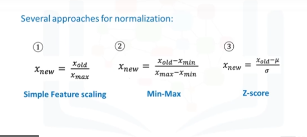
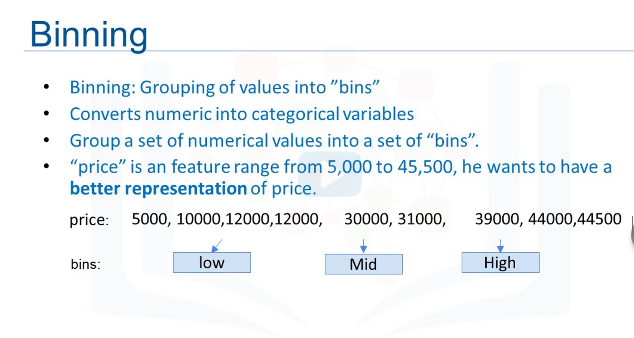

# data_analysis_with_python

# 1 Scientifics Computing Libraries in Python ==> files, dataframes, 2D,3D arrays and computings


# 2 Visualization Libraries ==> Graphs and maps and ...


# 2 Algorithmic Libraries ==> Machin learning


# Importing and Exporting Data in Python


```
import pandas as pd

df = pd.read_csv("csv_sample.csv")
df = pd.read_csv("csv_sample.csv", header = None)
print(df.head(10))
print(df.tail(10))
print(df.columns)
df = pd.read_csv("csv_sample.csv")
print(df.columns)
df.to_csv("output.csv")

print(df.dtypes) # ==> type of all columns
print(df.describe()) # ==> returns a statistical summary
print(df.describe(include="all")) # ==> returns full statistical summary
#Some of this data is NaN its because that particular statistical metric cannot be calculated for that specific
print(df.info()) # ==> provides a concise summary of you DataFrame

```

# Data Pre-processing in Python also known as Data Cleaning or Data Wrangling
```
df["symboling"]
or 
df["body-style"]
If you want to add 1 to each symbiling entry:
df["symboling"] = df["symboling"] + 1

None or NaN value in DataFrame are missing value 
To ignore missing value you have a lot of ways
1: Drop missing values with their rows:
==> dataframes.dropna()
==> df = df.dropna(subset=["price"], axis=0, inplace=True)
To delete row    axis=0
To delete column axis=1
“Inplace=True” just writes the result back into the dataframe.

Don’t forget that this line of code does not change the dataframe:
df = df.dropna(subset=["price"], axis=0)
To modify the dataframe, you have to set the parameter "inplace" equal to true.
df.dropna(subset=["price"], axis=0, inplace=True)

2: Replace missing values:
In Python, first we calculate the mean of the column

import numpy as np

datefram.replace(missing_value, new_value)
print(df["RAB_EST_SR_CS"].mean())
mean = df["RAB_EST_SR_CS"].mean()
df["RAB_EST_SR_CS"].replace(np.nan, mean)

To transform mpg to L/100km we need to divide 235 by each value in the city-mpg column.
df["city-mpg"] = 235/df["city-mpg"]
Rename column name from "city-mpg" to "city-L/100km" using
df.rename(columns={"RAB_EST_SR_CS": "New_Name"}, inplace=True)

To convert datatype to anohter datatype use this:
df["PAGING_INTENSITY(PPS/CELL)"] = df["PAGING_INTENSITY(PPS/CELL)"].astype("float")

```
# Data Normalization
## We have three type of Normalization, lock at the picture



```
Simple feature scaling:
df["PAGING_INTENSITY(PPS/CELL)"] = df["PAGING_INTENSITY(PPS/CELL)"]/df["PAGING_INTENSITY(PPS/CELL)"].max()

Min-Max:
df["PAGING_INTENSITY(PPS/CELL)"] = (df["PAGING_INTENSITY(PPS/CELL)"]-df["PAGING_INTENSITY(PPS/CELL)"].min())/(df["PAGING_INTENSITY(PPS/CELL)"].max()-df["PAGING_INTENSITY(PPS/CELL)"].min())

Z-score:
mean method will return the avg value and std method will return the standard deviation of the features in the dataset.
df["PAGING_INTENSITY(PPS/CELL)"] = (df["PAGING_INTENSITY(PPS/CELL)"]-df["PAGING_INTENSITY(PPS/CELL)"].mean())/df["PAGING_INTENSITY(PPS/CELL)"].std()

```
# Binning in python



```
binwidth = int(((max(df["RAB_EST_SR_CS"])-min(df["RAB_EST_SR_CS"]))/4))
bins = range(int(min(df["RAB_EST_SR_CS"])), int(max(df["RAB_EST_SR_CS"])) , binwidth)
group_names = ['Low', 'Medium', 'High']
df['RAB_EST_SR_CS'] = pd.cut(df['RAB_EST_SR_CS'], bins, labels=group_names)

```
