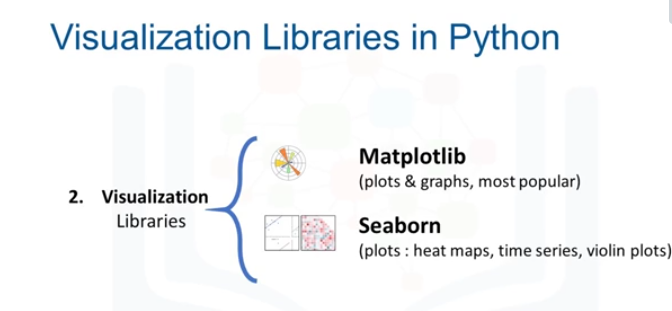
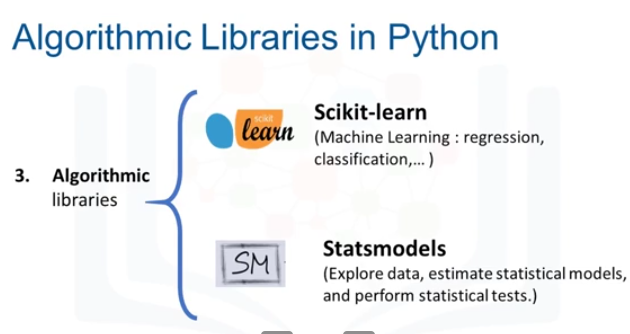

# data_analysis_with_python

# 1 Scientifics Computing Libraries in Python ==> files, dataframes, 2D,3D arrays and computings

# 2 Visualization Libraries ==> Graphs and maps and ...

# 2 Algorithmic Libraries ==> Machin learning

# Importing and Exporting Data in Python
