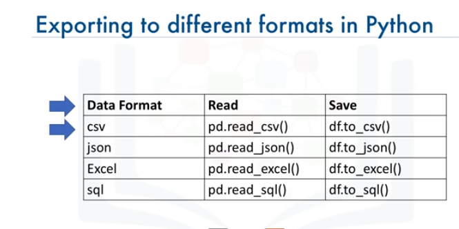

# data_analysis_with_python

# 1 Scientifics Computing Libraries in Python ==> files, dataframes, 2D,3D arrays and computings


# 2 Visualization Libraries ==> Graphs and maps and ...


# 2 Algorithmic Libraries ==> Machin learning


# Importing and Exporting Data in Python



```
import pandas as pd

df = pd.read_csv("csv_sample.csv")
df = pd.read_csv("csv_sample.csv", header = None)
print(df.head(10))
print(df.tail(10))
print(df.columns)
df = pd.read_csv("csv_sample.csv")
print(df.columns)
df.to_csv("output.csv")

print(df.dtypes) # ==> type of all columns
print(df.describe()) # ==> returns a statistical summary
print(df.describe(include="all")) # ==> returns full statistical summary
#Some of this data is NaN its because that particular statistical metric cannot be calculated for that specific
print(df.info()) # ==> provides a concise summary of you DataFrame

```

# Data Pre-processing in Python also known as Data Cleaning or Data Wrangling
```
df["symboling"]
or 
df["body-style"]
If you want to add 1 to each symbiling entry:
df["symboling"] = df["symboling"] + 1

None or NaN value in DataFrame are missing value 
To egnore missing value you can 
```
